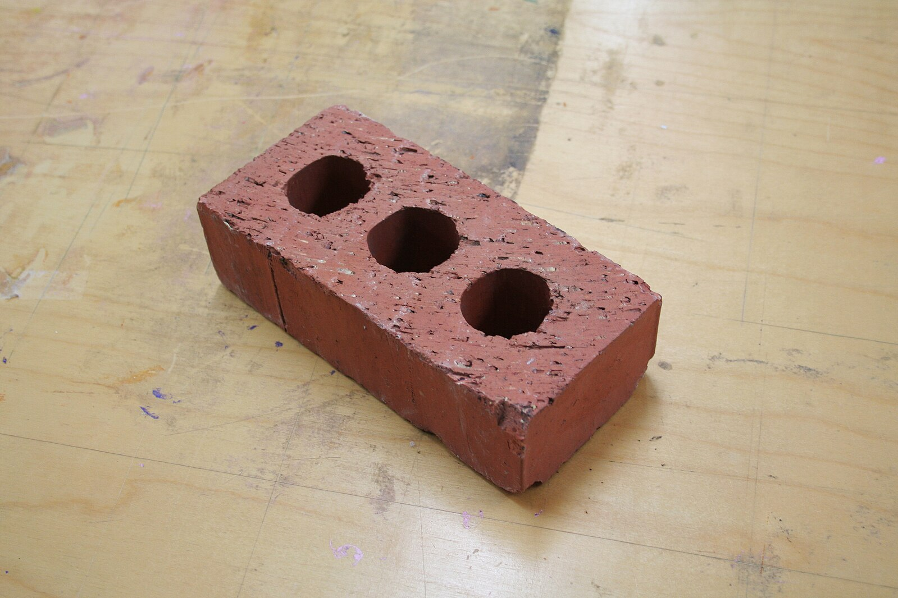
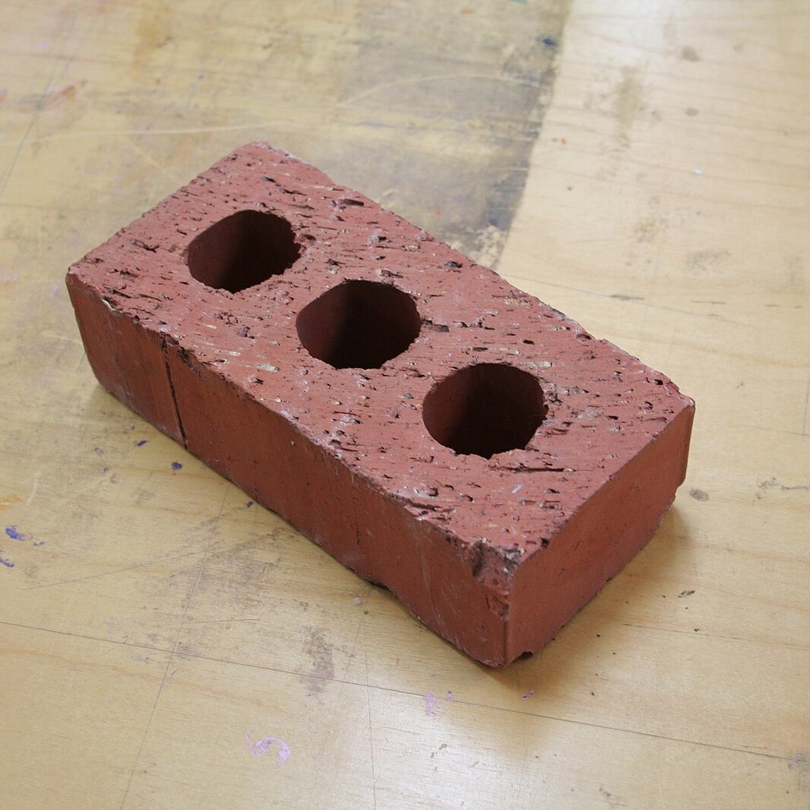

# Asset Attribution and Credits
## Images
### bricks/0.jpg

Photo by [Andrewlister](https://commons.wikimedia.org/wiki/User:Andrewlister) licensed under the Public Domain, via [Wikimedia Commons](https://commons.wikimedia.org/wiki/File:Brick.jpg).

## favicons/brick.jpg

Adapted by [luminousherbs](https://github.com/luminousherbs), using photo by [Andrewlister](https://commons.wikimedia.org/wiki/User:Andrewlister) licensed under the Public Domain, via [Wikimedia Commons](https://commons.wikimedia.org/wiki/File:Brick.jpg).

## bricks/0_hat.jpg

Adapted by [luminousherbs](https://github.com/luminousherbs), using photo by [Andrewlister](https://commons.wikimedia.org/wiki/User:Andrewlister) licensed under the Public Domain, via [Wikimedia Commons](https://commons.wikimedia.org/wiki/File:Brick.jpg), and photo from [Library of Congress](https://www.loc.gov/), via [Wikimedia Commons](https://commons.wikimedia.org/wiki/File:Austin_Lane_Crothers,_photograph_of_head_with_top_hat.jpg).

## All other assets, including code
Created by [luminousherbs](https://github.com/luminousherbs), available for use under the MIT License.
